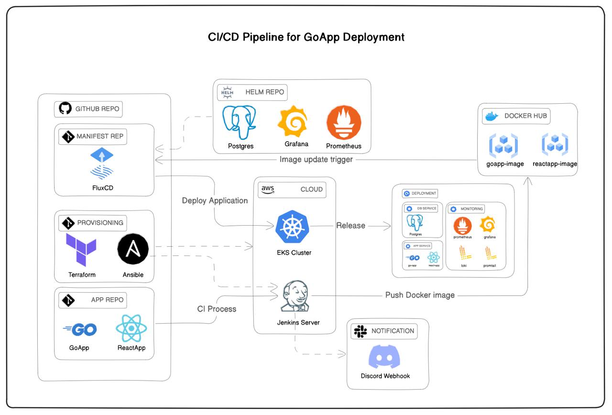

# CI/CD Pipeline fo Go & React Deployment
#### _Final Exam Bootcamp StudiDevOps16_

## Resource :
#### 1. Git Repository
- GoApp
- ReactApp
- FluxCD

#### 2. AWS Cloud
- EKS for Kubernetes Custer
- EC2 Instance for Jenkins Server

#### 3. Helm Repository
- Grafana
- Prometheus
- Postgres

#### 4. Docker Hub
- GoApp Image
- ReactApp Image

#### 5. Discord
- Notification

## Deployment Object :
- Backend : GoApp
- Frontend : ReactApp
- Database : PostgreSQL

## Tools :
| Name                     | Platform  |
|--------------------------| --------- |
| Provisioning Tools       | Terraform |
| Configuration Management | Ansible |
| CI / CD Tools | Jenkins. FluxCD |
| Secret Management | SOPs, Age |
| Monitoring & Logging | Prometheus, Grafana, Loki |

